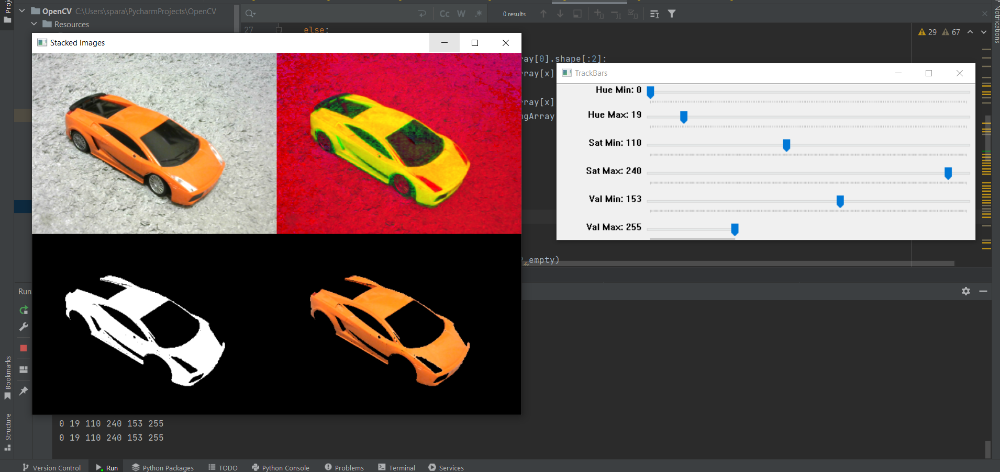
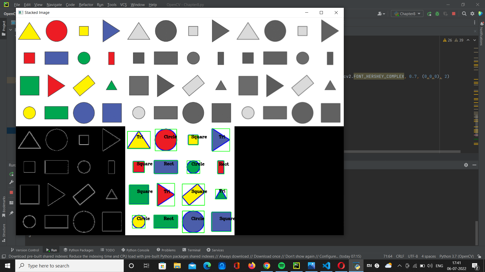
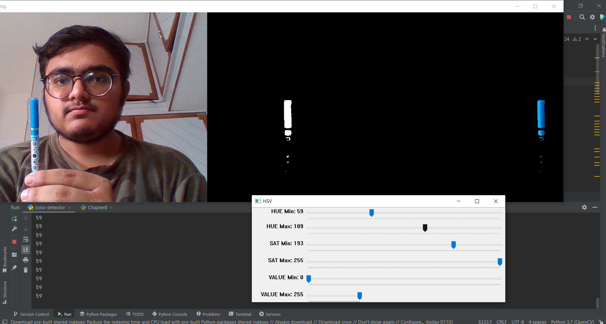
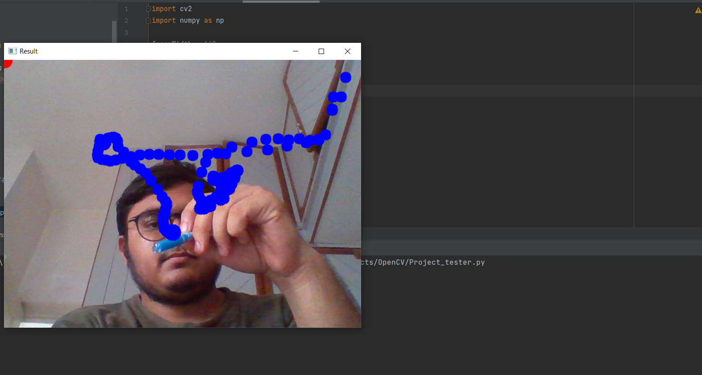

# DrawOnScreen

This project made in OpenCV helps us draw on screen
using just object gestures.  

• Firstly, we set ranges of hue, saturation and values and use those values to detect the colour of the object through camera.

• Then we write a function to detect the contour of the objects through camera.  

• We then create a draw on screen function which will draw small circles on the screen depending upon the object/colour they have detected there.

## Process

First I wrote a script so that I can detect object colours in openCV. 

Then I wrote a script to detect shapes by detecting the contours in the image

Now with actual video camera, I detected some Hue, Saturation and Values using the actual webcam and hardcoded the values in the code file.

Atlast, I applied the draw on screen function which would detect the color of the object and then draw on the screen accordingly.

